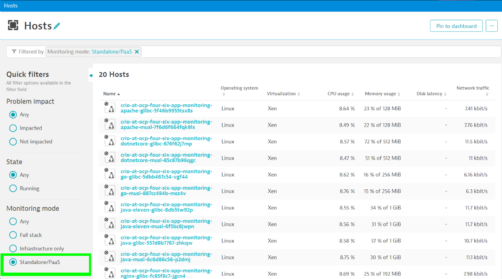

# Custom Container Integration for Distributed Tracing on Windows based containers

Dynatrace provides an automatic and unified way to inject into container hosted applications/processes referred as [Universal Injection](universalinjection.md). In some scenarios like sandboxed container runtimes or Windows containers you need to use technology specific instructions to integrate OneAgent Code-Modules into your application processes such as e.g. Java.

## Prerequisites
Before you begin to modify your container images to observe your applications using Dynatrace, you'll need to prepare the following: 

1. API Token to access the Dynatrace REST API
   
   [Create an API Token](https://www.dynatrace.com/support/help/dynatrace-api/basics/dynatrace-api-authentication) with **"InstallerDownload"** permissions. The token created is later referenced as ```<API-TOKEN>```
   
   

2. API endpoint url, later referened as ```<ADDRESS>```
   1. Using your environments [cluster-endpoint](https://www.dynatrace.com/support/help/get-started/monitoring-environment/environment-id)
   2. or alternatively an [ActiveGate](https://www.dynatrace.com/support/help/setup-and-configuration/dynatrace-activegate) address.

3. Dynatrace connection parameters
   
   To configure the OneAgent Code-Modules to connect to Dynatrace, you need to retrieve the agent connection parameters via the Dynatrace API:  

   API Endpoint ```<ADDRESS>/api/v1/deployment/installer/agent/connectioninfo?Api-Token=<API-TOKEN>```

   You can e.g. use **curl** to retrieve the information as a Json payloud:
    ```
    {
        "tenantUUID" : "XXXXXXXX",
        "tenantToken" : "XXXXXXXXXX",
        "communicationEndpoints" :  [ "https://XXXXXXX:9999/communication", "https://YYYYYYY/communication"],
        "formattedCommunicationEndpoints" : "https://XXXXXXX:9999/communication;https://YYYYYYY/communication"
    }
    ```

    For security resons, we recommand to store the credentials in a security vault you can later use to pass it to your containers.

## Container Image Build-Time Integration for Windows based containers

To integrate OneAgent code-modules, Dynatrace provides a [REST API to download packages containing OneAgent Code-Modules](https://www.dynatrace.com/support/help/dynatrace-api/environment-api/deployment/oneagent) available on your cluster. 

### Enhance your container image

To allow tracing of your containerized application, download and extract necessary Dynatrace artifacts from Dynatrace API to your applicaiton image. 

Depending on your preferences and needs to build your container images, you may choose from different ways to integrate necessary artifacts to your images 
e.g. using a mounted volume, create a custom filesystem-layer or copy from a 3rd party location such as artifactory to your image. 

#### 1. Download OneAgent Code-Modules using a Multi-Stage build 

To reduce image size and container startup, many runtime-images are highly optimized images that only contain necessary runtimes. 

[Multi-Stage Builds](https://docs.docker.com/develop/develop-images/multistage-build/#use-multi-stage-builds) allow you to easily extend your container image without the need to change your base-image and you can copy from one stage to the other. 

Add the following stage to your dockerfile to [download](https://www.dynatrace.com/support/help/dynatrace-api/environment-api/deployment/oneagent/download-oneagent-latest) and extract the OneAgent Code-Modules at image build-time. 

```
FROM mcr.microsoft.com/powershell AS dynatrace
ARG DT_ADDRESS
ARG DT_API_TOKEN
ARG DT_INCLUDE=all
ARG DOWNLOAD_URI=$DT_ADDRESS/api/v1/deployment/installer/agent/windows/paas/latest?Api-Token=$DT_API_TOKEN&flavor=default&include=$DT_INCLUDE
RUN mkdir "c:\\programdata\\dynatrace\\oneagent"
RUN powershell -Command "Invoke-Webrequest -O 'c:\\programdata\\dynatrace\\oneagent.zip' -Uri $Env:DOWNLOAD_URI"
RUN powershell -Command "expand-archive -Path 'c:\\programdata\\dynatrace\\oneagent.zip' -DestinationPath 'c:\\programdata\\dynatrace\\oneagent\\'"  
```

This stage depends on severall build-time variables to control the d:ownload. The arguments need to be set at image build-time using ```--build-arg```

```docker build . -t <YOUR-IMAGE-NAME> --build-arg "DT_ADDRESS=<ADDRESS>" --build-arg "<DT_API_TOKEN=<ADDRESS>" ``` 

**Note** 
* Replace ```<YOUR-IMAGE-NAME>```, ```<DT_API_TOKEN>``` and ```<ADDRESS>```
* To reduce image size, you can selectivle choose which artifacts to include by using a differant technology flag additionally setting ```DT_INCLUDE```. By default, all Code-Modules are downloaded
  
|Tag|Oneagent Code-Module|
|---|---|
|java| [Java](https://www.dynatrace.com/support/help/technology-support#java-and-scala)  |
|dotnet| [.NET / .NET Core](https://www.dynatrace.com/support/help/technology-support#net-and-net-core) |
|nodejs| [Node.js](https://www.dynatrace.com/support/help/technology-support#node-js) |
|go| [GoLang](https://www.dynatrace.com/support/help/technology-support#go) |
|php| [PHP](https://www.dynatrace.com/support/help/technology-support#php) |
|iis| [Microssoft Ineternet Information Server (IIS)](https://www.dynatrace.com/support/help/technology-support#microsoft-iis)|
|apache| [Apache Http](https://www.dynatrace.com/support/help/technology-support#apache-http) |
|nginx| [NGINX](https://www.dynatrace.com/support/help/shortlink/section-technology-support#nginx) |
|all| All code-modules |

#### What about versioning?
By default the API endpoint downloads the lastest version, available and ompatible with your cluster version. Alternatively you can use a[different API endpoint, which also allows to specify a specific version. For more details see [REST API documentation](https://www.dynatrace.com/support/help/dynatrace-api/environment-api/deployment/oneagent)

#### 2. Copy Dynatrace Code-Modules to your base layer
With the Dynatrace artifacts downloaded in the previous stage named ```dynatrace``, you can now enhance your dockerfile to copy the extracted content to your application layer. 

```
RUN mkdir "c:\\programdata\\dynatrace\\oneagent"
WORKDIR /programdata/dynatrace/oneagent/
COPY --from=dynatrace /programdata/dynatrace/oneagent/ .
```

### 3. Configure agent (OneAgent Code-Modules) 
To configure connection parameters, you need to set following environment variables within your container:

|Name|Description|
|---|---|
|DT_TENANT| This is your **environment id**|
|DT_TENANTTOKEN| Use **tenantToken** retrieved from agent connection paraemeters |
|DT_CONNECTION_POINT| Use **formattedCommunicationEndpoints** retrieved from agent connection paraemeters|

**Note**

To prevent leaking access tokens, you should pass the connection parameters dynamically when starting the container. Most container runtimes even allow to pass secrets stored within a secret-vault securely as environment variables when starting the container.   


### Additional Configuration
You can use additional environment variables to configure the agent for e.g. troubleshooting or advanced networking.

|Name|Description|
|---|---|
| **Networking** ||
| DT_NETWORK_ZONE | Specifies to use a network zone. See [network zones](https://www.dynatrace.com/support/help/setup-and-configuration/network-zones) for more information. |
| DT_PROXY | When using a proxy, use this environment variable to pass proxy credentials. [Read more](https://www.dynatrace.com/support/help/setup-and-configuration/setup-on-container-platforms/docker/set-up-oneagent-on-containers-for-application-only-monitoring) |
| **Additional metadata for Process Grouping / Service Detection** ||
| DT_LOCALTOVIRTUALHOSTNAME | multiple containers are sometimes detected as a single instance (localhost) leading to various problems e.g. in service detection or availability alerts. Use this environment variable to define a unique name for your container instance. [Read more](https://www.dynatrace.com/support/help/how-to-use-dynatrace/services/service-detection-and-naming#adjusting-service-detection)|
| DT_APPLICATIONID | Some technologies don't provide unique application names. In such cases, use this environment variable to provide a unique name. [Read more](https://www.dynatrace.com/support/help/how-to-use-dynatrace/services/service-detection-and-naming#web-server-naming-issues)|
| DT_TAGS | Applies [custom tags](https://www.dynatrace.com/support/help/how-to-use-dynatrace/tags-and-metadata/setup/define-tags-based-on-environment-variables) to your process group |
| DT_CUSTOM_PROP | Applies [custom metadata](https://www.dynatrace.com/support/help/how-to-use-dynatrace/process-groups/configuration/define-your-own-process-group-metadata) to your process group|
| DT_CLUSTER_ID | If the [process group detection rules](https://www.dynatrace.com/support/help/shortlink/process-groups) won't work for your use-case, use this environment variable to **group all processes with the same value**. |
| DT_NODE_ID | If the [process group detection rules](https://www.dynatrace.com/support/help/shortlink/process-groups) won't work for your use-case, use this environment variable to **separate process group instances**|
| **Troubleshooting** ||
| DT_LOGSTREAM | Set this variable with ```stdout``` to configure agent to log errors into console. To see additional agent logs set the log-level with DT_LOGLEVELCON as follows  |
| DT_LOGLEVELCON | Use this environment variable to define console log-level. Valid options are ```NONE```, ```SEVERE```, ```INFO``` in order to increase log-level. |
|DT_AGENTACTIVE| ```true``` or ```false``` to enable or disable agent |

### 4. Enable injection of OneAgent Code-Modules

#### Java

For Java, enhance the java command line with following parameters

```-Xshare:off -Djava.net.preferIPv4Stack=true -agentpath:/opt/dynatrace/oneagent/agent/lib64/liboneagentloader.so```

You can use environment variables to enhance the java commandline. You need environment variables such as ```JAVA_TOOL_OPTIONS```, ```JAVA_OPTS```, ```CATALINA_OPTS``` according to your used technology stack.

E.g. 
```ENV JAVA_TOOL_OPTIONS="$JAVA_TOOL_OPTIONS -Xshare:off -Djava.net.preferIPv4Stack=true -agentpath:/opt/dynatrace/oneagent/agent/lib64/liboneagentloader.so"```


#### .NET Framework

```
ENV COR_ENABLE_PROFILING="0x01"
ENV COR_PROFILER="{B7038F67-52FC-4DA2-AB02-969B3C1EDA03}"
ENV COR_PROFILER_PATH_32="c:/programdata/dynatrace/oneagent/agent/bin/windows-x86-32/oneagentloader.dll"
ENV COR_PROFILER_PATH_64="c:/programdata/dynatrace/oneagent/agent/bin/windows-x86-64/oneagentloader.dll"
ENV COR_PROFILER_PATH="c:/programdata/dynatrace/oneagent/agent/bin/windows-x86-64/oneagentloader.dll"
```

#### .NET/.NET Core
```
ENV CORECLR_ENABLE_PROFILING="0x01"
ENV CORECLR_PROFILER="{B7038F67-52FC-4DA2-AB02-969B3C1EDA03}"
ENV CORECLR_PROFILER_PATH_32="c:/programdata/dynatrace/oneagent/agent/bin/windows-x86-32/oneagentloader.dll"
ENV CORECLR_PROFILER_PATH_64="c:/programdata/dynatrace/oneagent/agent/bin/windows-x86-64/oneagentloader.dll"
ENV CORECLR_PROFILER_PATH="c:/programdata/dynatrace/oneagent/agent/bin/windows-x86-64/oneagentloader.dll"
```

## Example - Containerized .NET 6 application
Assuming you have a containerized .NET 6 application with a dockerfile like this:

```
FROM mcr.microsoft.com/dotnet/aspnet:6.0 
ARG APP_FOLDER=app/
EXPOSE 80

RUN mkdir "c:\app"
WORKDIR /app
COPY ${APP_FOLDER} .

ENTRYPOINT ["dotnet","MyAspNetApp.dll"]
```

### Your dockerfile needs to be enhanced like the following:
```
FROM mcr.microsoft.com/dotnet/aspnet:6.0 AS base
ARG APP_FOLDER=app/
EXPOSE 80

RUN mkdir "c:\app"
WORKDIR /app
COPY ${APP_FOLDER} .

#Add stage to download Dynatrace Code-Modules
FROM mcr.microsoft.com/powershell AS dynatrace
ARG DT_ADDRESS
ARG DT_API_TOKEN
ARG DT_INCLUDE=all
ARG DOWNLOAD_URI=$DT_ADDRESS/api/v1/deployment/installer/agent/windows/paas/latest?Api-Token=$DT_API_TOKEN&flavor=default&include=$DT_INCLUDE
RUN mkdir "c:\\programdata\\dynatrace\\oneagent"
RUN powershell -Command "Invoke-Webrequest -O 'c:\\programdata\\dynatrace\\oneagent.zip' -Uri $Env:DOWNLOAD_URI"
RUN powershell -Command "expand-archive -Path 'c:\\programdata\\dynatrace\\oneagent.zip' -DestinationPath 'c:\\programdata\\dynatrace\\oneagent\\'"  

#Advance base image to integrate Dynatrace
FROM base AS final

#Copy OneAgent Code-Modules from previous stage
RUN mkdir "c:\\programdata\\dynatrace\\oneagent"
WORKDIR /programdata/dynatrace/oneagent/
COPY --from=dynatrace /programdata/dynatrace/oneagent/ .

#Enable tracing for your .NET 6 application
ENV CORECLR_ENABLE_PROFILING="0x01"
ENV CORECLR_PROFILER="{B7038F67-52FC-4DA2-AB02-969B3C1EDA03}"
ENV CORECLR_PROFILER_PATH_32="c:/programdata/dynatrace/oneagent/agent/bin/windows-x86-32/oneagentloader.dll"
ENV CORECLR_PROFILER_PATH_64="c:/programdata/dynatrace/oneagent/agent/bin/windows-x86-64/oneagentloader.dll"
ENV CORECLR_PROFILER_PATH="c:/programdata/dynatrace/oneagent/agent/bin/windows-x86-64/oneagentloader.dll"

ENTRYPOINT ["dotnet","MyAspNetApp.dll"]
```
**Note**
* The initial FROM clause for the base image has been enhanced with ```AS base``` so it can be referenced in later stage.

### Build your container 
```
docker build --build-arg "DT_ADDRESS=<ADDRESS>" --build-arg "<DT_API_TOKEN=<ADDRESS>" . -t myaspnetapp
```

### Run the container
```
docker run -p 80:80 -e DT_TENANT='<YOUR-ENVIRONMENT-ID>' -e DT_TENANTTOKEN='<YOUR-TENANT_TOKEN>' -e='<YOUR-DT_CONNECTION_POINT>' myaspnetapp
```

**Note** 
* Replace the ```<YOUR-ENVIRONMENT-ID>```,   ```<YOUR-TENANT_TOKEN>``` and ```<YOUR-DT_CONNECTION_POINT>```  as described in [Prerequisites, step #3](#Prerequisites).
* To simplify the example, the credentials are directly passed as environment variables to the run command. For production cases, you should store the credentials within a secret vault of choice. Most managed container services allow to pass secure values from secret vaults as environment variables when running the container. 

## How-To verify the integration was successful
There are multiple ways to check if the integration was successful: 

### Via Services Overview
Check your services overview within Dynatrace for your instrumented application. It might be that Dynatrace cannot automatically detect a service within your instrumented application. In this case you should check with alternatives as listed below.

### Via Host Overview
You can filter for containers in the host overview to filter by **Monitoring Mode** with ```Standalone/PaaS```


### Via OneAgent Code-Module Logs
Check your agent logs as described [here](#Accessing-OneAgent-Code-Module-Logs)

## Troubleshooting

### Accessing OneAgent Code-Module Logs
By default, OneAgent Code-Modules log into /opt/dynatrace/oneagent/log/. If you cannot access your container via e.g. shell to inspect the logs, you can reconfigure the OneAgent Code-modules to log into **stdout**. 

Either modify your dockerfile adding following lines:
````
ENV DT_LOGLEVELCON=info 
ENV DT_LOGSTREAM=stdout
````
or pass them as environment variabls when running your container at startup:

Example using docker:
````
docker run -p 8080:8080 -e DT_TENANT='<YOUR-ENVIRONMENT-ID>' -e DT_TENANTTOKEN='<YOUR-TENANT_TOKEN>' -e='<YOUR-DT_CONNECTION_POINT>' -e='DT_LOGLEVELCON=INFO' -e='DT_LOGSTREAM=stdout' springio/gs-spring-boot-docker
````

To read more about logging configuration see [Additional Configuration#](#Additional-Configuration).