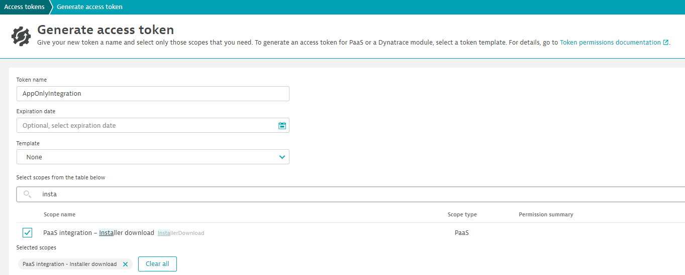
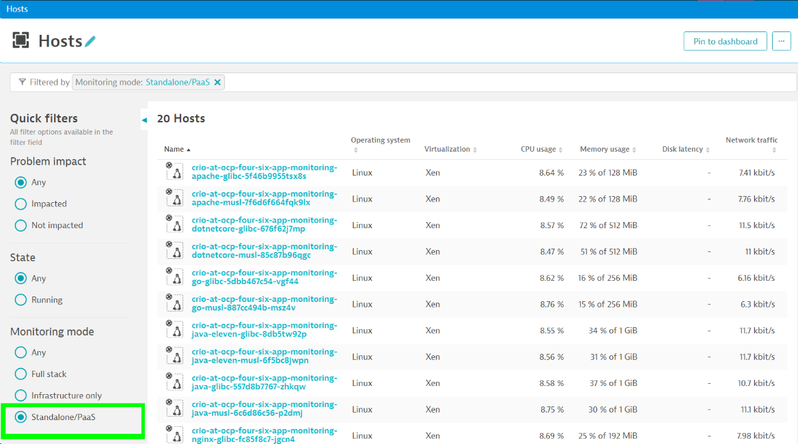

# Custom Container Integration for Distributed Tracing on Linux based containers using a custom private image repository

Dynatrace provides an automatic and unified way to inject into container hosted applications/processes of any [supported technology](https://www.dynatrace.com/support/help/technology-support) like Java, node.js, Golang, .NET/.NET Core, PHP as well as Webservers like Apache and NGINX. With this *Universal Injection* (often referred as *App-Only integration* as well) the integration of OneAgent Code-Modules at e.g. container build-time is easy and streamlined across all technolgies.  

## Prerequisites
Before you begin to modify your container images to observe your applications using Dynatrace, you'll need to prepare the following: 

1. API Token to access the Dynatrace REST API
   
   [Create an API Token](https://www.dynatrace.com/support/help/dynatrace-api/basics/dynatrace-api-authentication) with **"InstallerDownload"** permissions. The token created is later referenced as ```<API-TOKEN>```
   
   

2. API endpoint url, later referened as ```<ADDRESS>```
   1. Using your environments [cluster-endpoint](https://www.dynatrace.com/support/help/get-started/monitoring-environment/environment-id)
   2. or alternatively an [ActiveGate](https://www.dynatrace.com/support/help/setup-and-configuration/dynatrace-activegate) address.

3. Dynatrace connection parameters
   
   To configure the OneAgent Code-Modules to connect to Dynatrace, you need to retrieve the agent connection parameters via the Dynatrace API:  

   API Endpoint ```<ADDRESS>/api/v1/deployment/installer/agent/connectioninfo?Api-Token=<API-TOKEN>```

   You can e.g. use **curl** to retrieve the information as a Json payloud:
    ```
    {
        "tenantUUID" : "XXXXXXXX",
        "tenantToken" : "XXXXXXXXXX",
        "communicationEndpoints" :  [ "https://XXXXXXX:9999/communication", "https://YYYYYYY/communication"],
        "formattedCommunicationEndpoints" : "https://XXXXXXX:9999/communication;https://YYYYYYY/communication"
    }
    ```

    For security reasons, we recommand to store the credentials in a security vault you can later use to pass it to your containers.

4. Clone Oneagent container images
   Dynatrace provides a private container registry in every environment with container images containing  OneAgent Code-Modules available on your cluster. 

   The container registry is secured using your Dynatrace [environment ID](https://www.dynatrace.com/support/help/get-started/monitoring-environment/environment-id) as username, and your API-Token as password.

   It is recommended to tag your images including version information, later referred das ```<VERSION>```: 

   Retrieve the last version-info of your agent via the Dynatrace API

   API Endpoint ```<ADDRESS>/api/v1/deployment/installer/agent/unix/paas/latest/metainfo?flavor=multidistro&arch=all&bitness=all&Api-Token=<API-TOKEN>```

   You can use e.g. **curl** to retrieve the information as a Json payloud:
   ```
   {
      "latestAgentVersion": "1.273.172.20230920-141324"
   }
   ```
   Use e.g. ```1.273.172``` as your ```<VERSION>``` information in your tags. 


   First, login into you Dynatrace tenant repository:
   ```
   docker login -u <YOUR-ENVIRONMENT-ID> -p <API-TOKEN> <ADDRESS>
   ```

   Pull the code-module images:
   ```
   docker pull <ADDRESS>/linux/oneagent-codemodules:all-raw
   docker pull <ADDRESS>/linux/oneagent-codemodules-musl:all-raw
   docker pull <ADDRESS>/linux/oneagent-codemodules:dotnet-raw
   docker pull <ADDRESS>/linux/oneagent-codemodules-musl:dotnet-raw
   docker pull <ADDRESS>/linux/oneagent-codemodules:nodejs-raw
   docker pull <ADDRESS>/linux/oneagent-codemodules-musl:nodejs-raw
   docker pull <ADDRESS>/linux/oneagent-codemodules:java-raw
   docker pull <ADDRESS>/linux/oneagent-codemodules-musl:java-raw
   docker pull <ADDRESS>/linux/oneagent-codemodules:php-raw
   docker pull <ADDRESS>/linux/oneagent-codemodules-musl:php-raw
   docker pull <ADDRESS>/linux/oneagent-codemodules:go-raw
   docker pull <ADDRESS>/linux/oneagent-codemodules-musl:go-raw
   ```

   Create image alias to push to the target repository:
   ```
   docker tag <ADDRESS>/linux/oneagent-codemodules:all-raw <TARGET-REPOSITORY>/oneagent-codemodules:<VERSION>-amd64
   docker tag <ADDRESS>/linux/oneagent-codemodules-musl:all-raw <TARGET-REPOSITORY>/oneagent-codemodules:<VERSION>-alpine-amd64
   docker tag <ADDRESS>/linux/oneagent-codemodules:dotnet-raw <TARGET-REPOSITORY>/oneagent-codemodules:<VERSION>-dotnet-amd64
   docker tag <ADDRESS>/linux/oneagent-codemodules-musl:dotnet-raw <TARGET-REPOSITORY>/oneagent-codemodules:<VERSION>-dotnet-alpine-amd64
   docker tag <ADDRESS>/linux/oneagent-codemodules:nodejs-raw <TARGET-REPOSITORY>/oneagent-codemodules:<VERSION>-nodejs-amd64
   docker tag <ADDRESS>/linux/oneagent-codemodules-musl:nodejs-raw <TARGET-REPOSITORY>/oneagent-codemodules:<VERSION>-nodejs-alpine-amd64
   docker tag <ADDRESS>/linux/oneagent-codemodules:java-raw <TARGET-REPOSITORY>/oneagent-codemodules:<VERSION>-java-amd64
   docker tag <ADDRESS>/linux/oneagent-codemodules-musl:java-raw <TARGET-REPOSITORY>/oneagent-codemodules:<VERSION>-java-alpine-amd64
   docker tag <ADDRESS>/linux/oneagent-codemodules:php-raw <TARGET-REPOSITORY>/oneagent-codemodules:<VERSION>-php-amd64
   docker tag <ADDRESS>/linux/oneagent-codemodules-musl:php-raw <TARGET-REPOSITORY>/oneagent-codemodules:<VERSION>-php-alpine-amd64
   docker tag <ADDRESS>/linux/oneagent-codemodules:go-raw <TARGET-REPOSITORY>/oneagent-codemodules:<VERSION>-go-amd64
   docker tag <ADDRESS>/linux/oneagent-codemodules-musl:go-raw <TARGET-REPOSITORY>/oneagent-codemodules:<VERSION>-go-alpine-amd64

   ```

   Now login into your target repository:
   ```
   docker login -u <YOUR-REPOSITORY-USERNAME> -p <YOUR-REPOSITORY-PASSWORD> <TARGET-REPOSITORY>
   ```

   Push images to the target repository:
   ```
   docker push <TARGET-REPOSITORY>/oneagent-codemodules:<VERSION>-amd64
   docker push <TARGET-REPOSITORY>/oneagent-codemodules:<VERSION>-alpine-amd64
   docker push <TARGET-REPOSITORY>/oneagent-codemodules:<VERSION>-dotnet-amd64
   docker push <TARGET-REPOSITORY>/oneagent-codemodules:<VERSION>-dotnet-alpine-amd64
   docker push <TARGET-REPOSITORY>/oneagent-codemodules:<VERSION>-nodejs-amd64
   docker push <TARGET-REPOSITORY>/oneagent-codemodules:<VERSION>-nodejs-alpine-amd64
   docker push <TARGET-REPOSITORY>/oneagent-codemodules:<VERSION>-java-amd64
   docker push <TARGET-REPOSITORY>/oneagent-codemodules:<VERSION>-java-alpine-amd64
   docker push <TARGET-REPOSITORY>/oneagent-codemodules:<VERSION>-php-amd64
   docker push <TARGET-REPOSITORY>/oneagent-codemodules:<VERSION>-php-alpine-amd64
   docker push <TARGET-REPOSITORY>/oneagent-codemodules:<VERSION>-go-amd64
   docker push <TARGET-REPOSITORY>/oneagent-codemodules:<VERSION>-go-alpine-amd64
   ```
   

## Container Image Build-Time Integration

To integrate OneAgent code-modules using **Universal Injection*, Dynatrace provides a private container registry in every environment with container images containing  OneAgent Code-Modules available on your cluster. 

When manually building the image with docker, make sure you are logged in to your repository
```
   docker login -u <YOUR-REPOSITORY-USERNAME> -p <YOUR-REPOSITORY-PASSWORD> <TARGET-REPOSITORY>
   
```
### 1. Enhance your container image

To allow tracing of your containerized application, copy necessary Dynatrace artifacts from the provided registry images to your applicaiton image. 

Add following command to your dockerfile to copy the oneagent artefacts into your image:
```
COPY --from=<IMAGE-REPOSITORY>/oneagent-codemodules:<TAG> / /
```
replacing ```<IMAGE-REPOSITORY>``` and ```<TAG>``` according to your needs: 


You can use an image, containing all available code-modules using following tag:

```<VERSION>```-```amd64``` 

or if your application image is based on alpine linux choose:

```<VERSION>```-```alpine-amd64``` 

To reduce image size, you can limit to a specific technology choose which artifacts to include by using a different image tag.

The tags follow following schema: 

```<VERSION>```-```<TECHNOLOGY>```-```amd64``` 

or 

```<VERSION>```-```<TECHNOLOGY>```-```alpine-amd64``` 


|```<TECHNOLOGY>```|Oneagent code-module|
|---|---|
|java| [Java](https://www.dynatrace.com/support/help/technology-support#java-and-scala)  |
|dotnet| [.NET / .NET Core](https://www.dynatrace.com/support/help/technology-support#net-and-net-core) |
|nodejs| [Node.js](https://www.dynatrace.com/support/help/technology-support#node-js) |
|go| [GoLang](https://www.dynatrace.com/support/help/technology-support#go) |
|php| [PHP](https://www.dynatrace.com/support/help/technology-support#php) |


#### 2. Configure agent (OneAgent Code-Modules) 
To configure connection parameters, you need to set following environment variables within your container:

|Name|Description|
|---|---|
|DT_TENANT| This is your **environment id**|
|DT_TENANTTOKEN| Use **tenantToken** retrieved from agent connection paraemeters |
|DT_CONNECTION_POINT| Use **formattedCommunicationEndpoints** retrieved from agent connection paraemeters|

**Note**
To prevent leaking access tokens, you should pass the connection parameters dynamically when starting the container. Most container runtimes even allow to pass secrets stored within a secret-vault securely as environment variables when starting the container.  

#### Additional Configuration
You can use additional environment variables to configure the agent for e.g. troubleshooting or advanced networking.

|Name|Description|
|---|---|
| **Networking** ||
| DT_NETWORK_ZONE | Specifies to use a network zone. See [network zones](https://www.dynatrace.com/support/help/setup-and-configuration/network-zones) for more information. |
| DT_PROXY | When using a proxy, use this environment variable to pass proxy credentials. [Read more](https://www.dynatrace.com/support/help/setup-and-configuration/setup-on-container-platforms/docker/set-up-oneagent-on-containers-for-application-only-monitoring) |
| **Additional metadata for Process Grouping / Service Detection** ||
| DT_LOCALTOVIRTUALHOSTNAME | multiple containers are sometimes detected as a single instance (localhost) leading to various problems e.g. in service detection or availability alerts. Use this environment variable to define a unique name for your container instance. [Read more](https://www.dynatrace.com/support/help/how-to-use-dynatrace/services/service-detection-and-naming#adjusting-service-detection)|
| DT_APPLICATIONID | Some technologies don't provide unique application names. In such cases, use this environment variable to provide a unique name. [Read more](https://www.dynatrace.com/support/help/how-to-use-dynatrace/services/service-detection-and-naming#web-server-naming-issues)|
| DT_TAGS | Applies [custom tags](https://www.dynatrace.com/support/help/how-to-use-dynatrace/tags-and-metadata/setup/define-tags-based-on-environment-variables) to your process group |
| DT_CUSTOM_PROP | Applies [custom metadata](https://www.dynatrace.com/support/help/how-to-use-dynatrace/process-groups/configuration/define-your-own-process-group-metadata) to your process group|
| DT_CLUSTER_ID | If the [process group detection rules](https://www.dynatrace.com/support/help/shortlink/process-groups) won't work for your use-case, use this environment variable to **group all processes with the same value**. |
| DT_NODE_ID | If the [process group detection rules](https://www.dynatrace.com/support/help/shortlink/process-groups) won't work for your use-case, use this environment variable to **separate process group instances**|
| **Troubleshooting** ||
| DT_LOGSTREAM | Set this variable with ```stdout``` to configure agent to log errors into console. To see additional agent logs set the log-level with DT_LOGLEVELCON as follows  |
| DT_LOGLEVELCON | Use this environment variable to define console log-level. Valid options are ```NONE```, ```SEVERE```, ```INFO``` in order to increase log-level. |
| DT_AGENTACTIVE | ```true``` or ```false``` to enable or disable agent |


#### 3. Enable automatic injection of Dynatrace
To enable automatic injection of Dynatrace into your application processes add following environment variable to your dockerfile

```
ENV LD_PRELOAD /opt/dynatrace/oneagent/agent/lib64/liboneagentproc.so
```

## Example - Containerized Java Spring Boot application
Assuming you have a containerized Spring Boot java application as followed within this [tutorial](https://spring.io/guides/gs/spring-boot-docker/) resulting with a dockerfile like this:

```
FROM openjdk:8-jdk-alpine
ARG JAR_FILE=target/*.jar
COPY ${JAR_FILE} app.jar
ENTRYPOINT ["java","-jar","/app.jar"]
```

### Your dockerfile needs to be enhanced like the following:
```
FROM openjdk:8-jdk-alpine
ARG JAR_FILE=target/*.jar
COPY ${JAR_FILE} app.jar

# Enable Dynatrace
COPY --from=<ADDRESS>/linux/oneagent-codemodules:<VERSION>-java-alpine-amd64 / /
ENV LD_PRELOAD /opt/dynatrace/oneagent/agent/lib64/liboneagentproc.so

ENTRYPOINT ["java","-jar","/app.jar"]
```
**Note** 
* The base image is alpine linux based, so we chose the approprate tag for java alpine linux. 
* Replace the ```<ADDRESS>```  as described in [Prerequisites, step #2](#Prerequisites).
* Replace the ```<VERSION>```  as described above.

### Build your container using gradle
```
docker build --build-arg JAR_FILE=build/libs/\*.jar springio/gs-spring-boot-docker .
```
### Run the container
```
docker run -p 8080:8080 -e DT_TENANT='<YOUR-ENVIRONMENT-ID>' -e DT_TENANTTOKEN='<YOUR-TENANT_TOKEN>' -e='<YOUR-DT_CONNECTION_POINT>' springio/gs-spring-boot-docker
```

**Note** 
* Replace the ```<YOUR-ENVIRONMENT-ID>```,   ```<YOUR-TENANT_TOKEN>``` and ```<YOUR-DT_CONNECTION_POINT>```  as described in [Prerequisites, step #3](#Prerequisites).
* To simplify the example, the credentials are directly passed as environment variables to the run command. For production cases, you should store the credentials within a secret vault of choice. Most managed container services allow to pass secure values from secret vaults as environment variables when running the container. 

## How-To verify the integration was successful
There are multiple ways to check if the integration was successful: 

### Via Services Overview
Check your services overview within Dynatrace for your instrumented application. It might be that Dynatrace cannot automatically detect a service within your instrumented application. In this case you should check with alternatives as listed below.

### Via Host Overview
You can filter for containers in the host overview to filter by **Monitoring Mode** with ```Standalone/PaaS```


### Via OneAgent Code-Module Logs
Check your agent logs as described [here](#Accessing-OneAgent-Code-Module-Logs)

## Troubleshooting

### Accessing OneAgent Code-Module Logs
By default, OneAgent Code-Modules log into /opt/dynatrace/oneagent/log/. If you cannot access your container via e.g. shell to inspect the logs, you can reconfigure the OneAgent Code-modules to log into **stdout**. 

Either modify your dockerfile adding following lines:
````
ENV DT_LOGLEVELCON=info 
ENV DT_LOGSTREAM=stdout
````
or pass them as environment variabls when running your container at startup:

Example using docker:
````
docker run -p 8080:8080 -e DT_TENANT='<YOUR-ENVIRONMENT-ID>' -e DT_TENANTTOKEN='<YOUR-TENANT_TOKEN>' -e='<YOUR-DT_CONNECTION_POINT>' -e='DT_LOGLEVELCON=INFO' -e='DT_LOGSTREAM=stdout' springio/gs-spring-boot-docker
````

To read more about logging configuration see [Additional Configuration#](#Additional-Configuration).